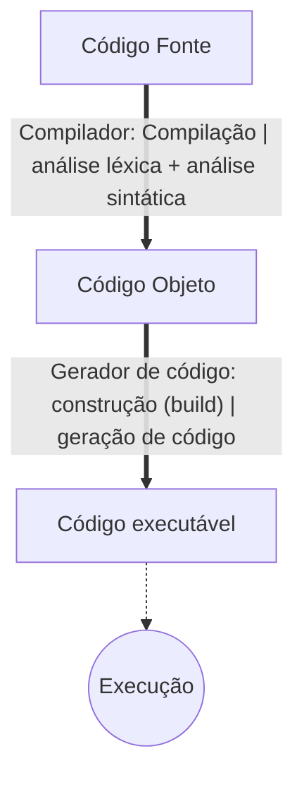
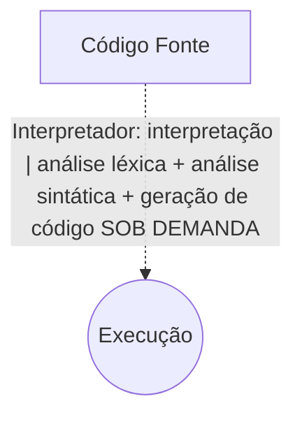
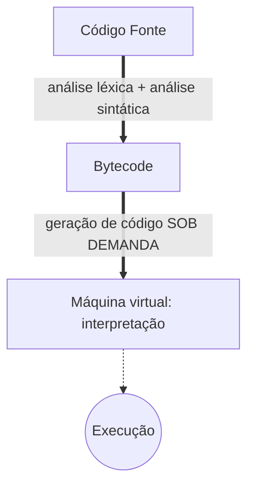
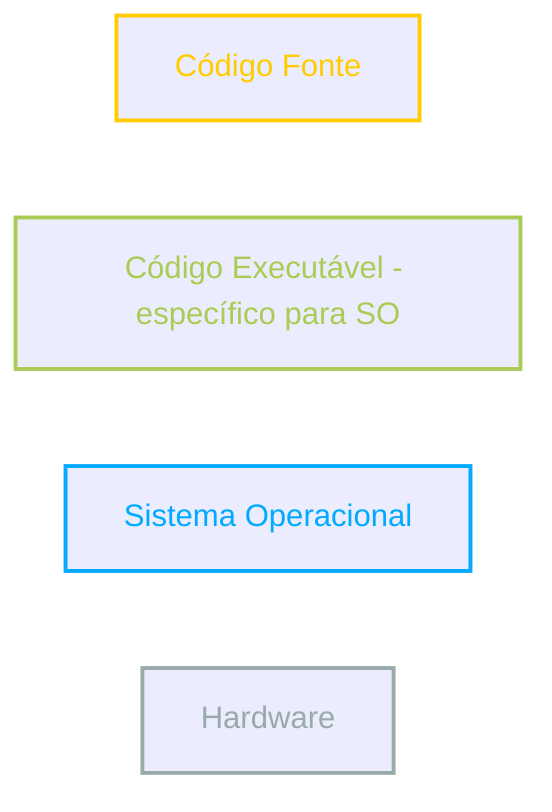
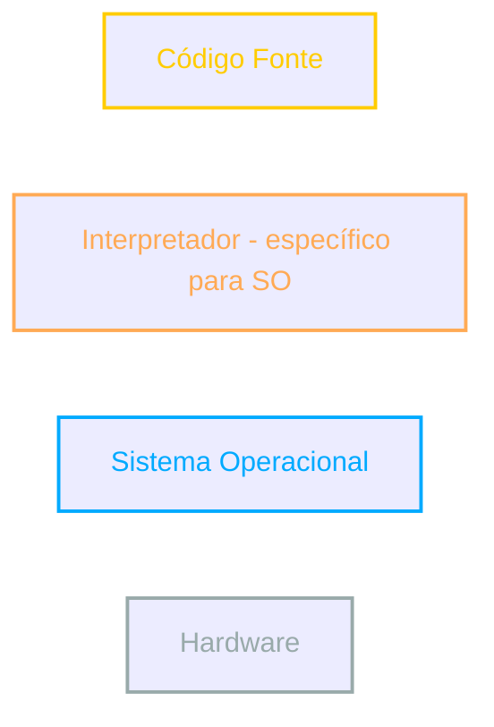
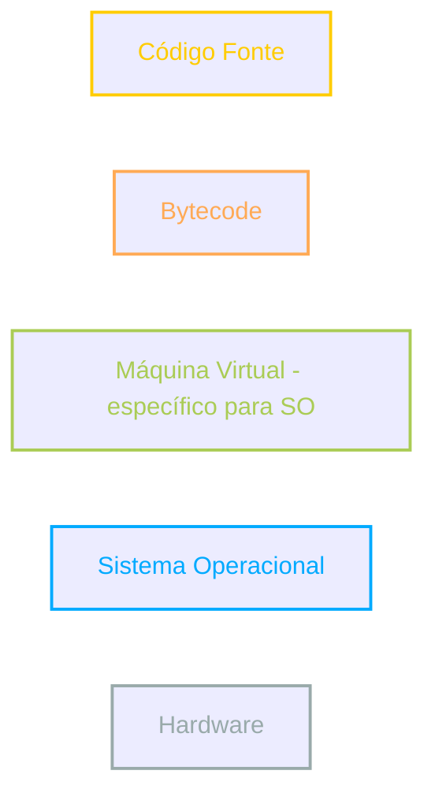
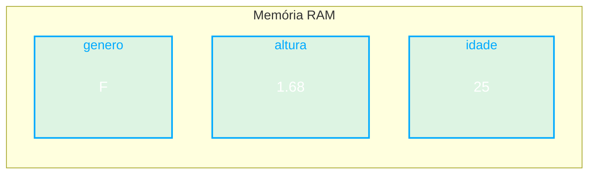

# java
 Repo for Udemy course Java primeiros passos: Lógica de Programação e Algoritmos by Nelio Alves

 ## Algoritmo, automação e programa de computador

 ### Algoritmo
 Sequência finita de instruções para se resolver um problema. (Aplica-se a diversas áreas do conhecimento)

 Exemplo: lavar a roupa

 Algoritmo:

 1)  Colocar a roupa em um recipiente
 2)  Colocar sabão
 3)  Encher de água
 4)  Mexer até dissolver o sabão
 5)  Deixar de molho por 20 minutos
 6)  Esfregar a orupa
 7)  Enxaguar
 8)  Torcer

 ### Automação
 Consiste em utilizar máquinas para executar o procedimento
 desejado de forma automática ou semiautomática

### Programa vs. Algoritmo

Programas de computador **são algoritmos** executados pelo computador (em linhas gerais).

Conclusão: o computador é uma máquina que **automatiza** a execução de **algoritmos** computacionais (processamento de dados, cálculos, etc).

##  O que é preciso para se fazer um programa de computador

Vamos precisar de:
- Uma **linguagem de programação**: regras léxicas e sintáticas para se escrever o programa.
- Uma **IDE**: software para editar e testar o programa
- Um **compilador**: software para trasnformar o **código fonte** em **código objeto**
- Um **gerador de código** ou **máquina virtual**: software que permite que o programa seja executado

## Linguagem de programação, léxica, sintática

### Linguagem de programação
Conjunto de regras léxicas (ortografia) e sintáticas (gramática) para se escrever programas.

## IDE - Ambiente Integrado de Desenvolvimento
É um conjunto de softwares utilizados para a construção de programas.

Exemplos:
- C/C++: Code Blocks
- Java: Eclipse, NetBeans
- C#: Microsoft Visual Studio

### Funcionalidades de uma IDE
- Edição de código fonte (endentação, autocompletar, destaque de palavras, etc)
- Depuração e testes
- Construção do produto final (build)
- Sugestão de modelos (templates)
- Auxiliar em várias tarefas do seu projeto

## Compilação, interpretação, código fonte e objeto, máquina virtual

### Compilação

**Código fonte**: 
Aquele escrito pelo programador em linguagem de programação.

**Compilação**: 
Processo que transforma o código fotne em código objeto.

Exemplos de linguagem que tipicamente usam essa abordagem: *C, C++*

#### Vantagens
- velocidade do programa
- auxilio do compilador antes da execução

 

### Interpretação

Exemplos de linguagem que tipicamente usam essa abordagem: *PHP, JavaScript, Python, Ruby*

#### Vantagens
- flexibilidade de manutenção do aplicativo em produção
- expressividade da linguagem
- código fonte não precisa ser recompilado para rodar em plataformas diferentes

 

### Abordagem Híbrida

Exemplos de linguagem que tipicamente usam essa abordagem: *Java (JVM), C# (Microsoft .NET Framework)*

#### Vantagens
- código fonte não precisa ser recompilado para rodar em plataformas diferentes
- auxilio do compilador antes da execução

#### Vantagens parciais
- velocidade do programa
- flexibilidade de manutenção do aplicativo em produção

 

**C/C++**

 

**PHP, Python, JS**

 

**Java, C#**

## Visão geral do capítulo Estrutura Sequencia

**Estrutura Sequencial**: 
Para enfatizar que os comandos do algoritmo **executam em sequência, de cima para baixo.** Um algoritmo deve obedecer uma **sequência lógica** adequada para cumprir seu papel.

**Errado**:

    soma = x + y;
    x = sc.nextDouble();
    y = sc.nextDouble();
    Systemm.out.println("Soma =" + soma);
    
**Correto**:

    x = sc.nextDouble();
    y = sc.nextDouble();
    soma = x + y;
    Systemm.out.println("Soma =" + soma);

## Expressões aritméticas

São aquelas que quando calculadas o resultado será um valor numérico. 
Ex.: 4 + 2 = 6

### Operadores aritméticos

|Operador|Significado|
|-|-|
|+|Adição|
|-|Subtração|
|*|Multiplicação|
|/|Divisão|
|%|Resto da divisão "mod"|

Precedência:
1) &lowast;, / e %
2) &plus; e -

## Variáveis e tipos básicos em Java

Um programa de computador em execução lida com dados, e esses dados são armazenados em variáveis.

### Variáveis
Em programação, uma variável é uma porção de memória (RAM) utilizada para armazenar dados durante a execução dos programas.

#### Declaração de variáveis

**Sintaxe**: 

    <tipo> <nome> = <valor inicial>;
&lowast; valor inicial é opcional

**Exemplos:** 

    int idade = 25;
    double altura = 1.68;
    char genero = 'F';

&lowast; *char* corresponde a um caracter unicode, podendo ser uma letra, um número, etc.

**Uma variável possui:**
- Nome (ou identificador)
- Tipo
- Valor
- Endereço

### Tipos primitivos em Java

|Descrição|Tipo|Tamanho|Valores|Valor padrão|
|-|-|-|-|-|
|tipos numéricos inteiros|**byte**|8 bits|-128 a 127|0|
|tipos numéricos inteiros|**short**|16 bits|-32768 a 32767|0|
|tipos numéricos inteiros|**int**|32 bits|-2147483648 a 2147483647|0|
|tipos numéricos inteiros|**long**|64 bits|-9223372036854770000 a 9223372036854770000|0L|
|tipos numéricos com ponto flutuante|**float**|32 bits|-1,4024E-37 a 3,4028E+38|0.0f|
|tipos numéricos com ponto flutuante|**double**|64 bits|-4,94E-307 a 1,79E+308|0.0|
|um caractere Unicode|**char**|16 bits|'\u0000' a '\uFFFF'|'\u0000'|
|valor verdade|**boolean**|1 bits|{false, true}|false|

Unicode - Ex.: 'a' = '\u0061'; 
[Referência](https://symbl.cc/en/)

A quantidade de bits representa o número de valores possíveis diferentes que o tipo da variavel pode armazenar.

Um bit pode armazenar 2 valores possíveis: 0 ou 1 - cada bit, 2 possibilidades.  Portanto 8 bits = 2⁸ = 256 possibilidades => em uma variavel de 8 bits poderia ser armazenado do valor 0 ao 255, por exemplo. Mas uma parte é reservada a números negativos, então -128 + 127 + 0 = 256.