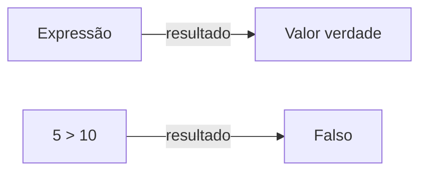
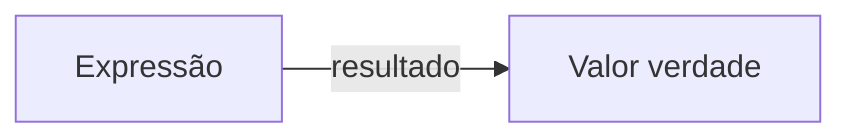
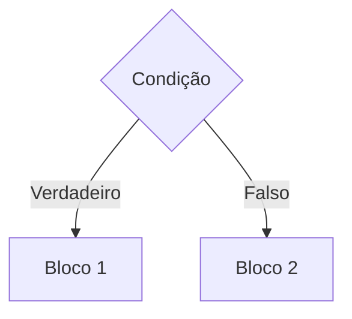

# java
 Repo for Udemy course Java primeiros passos: Lógica de Programação e Algoritmos by Nelio Alves

 ## Algoritmo, automação e programa de computador

 ### Algoritmo
 Sequência finita de instruções para se resolver um problema. (Aplica-se a diversas áreas do conhecimento)

 Exemplo: lavar a roupa

 Algoritmo:

 1)  Colocar a roupa em um recipiente
 2)  Colocar sabão
 3)  Encher de água
 4)  Mexer até dissolver o sabão
 5)  Deixar de molho por 20 minutos
 6)  Esfregar a orupa
 7)  Enxaguar
 8)  Torcer

 ### Automação
 Consiste em utilizar máquinas para executar o procedimento
 desejado de forma automática ou semiautomática

### Programa vs. Algoritmo

Programas de computador **são algoritmos** executados pelo computador (em linhas gerais).

Conclusão: o computador é uma máquina que **automatiza** a execução de **algoritmos** computacionais (processamento de dados, cálculos, etc).

##  O que é preciso para se fazer um programa de computador

Vamos precisar de:
- Uma **linguagem de programação**: regras léxicas e sintáticas para se escrever o programa.
- Uma **IDE**: software para editar e testar o programa
- Um **compilador**: software para trasnformar o **código fonte** em **código objeto**
- Um **gerador de código** ou **máquina virtual**: software que permite que o programa seja executado

## Linguagem de programação, léxica, sintática

### Linguagem de programação
Conjunto de regras léxicas (ortografia) e sintáticas (gramática) para se escrever programas.

## IDE - Ambiente Integrado de Desenvolvimento
É um conjunto de softwares utilizados para a construção de programas.

Exemplos:
- C/C++: Code Blocks
- Java: Eclipse, NetBeans
- C#: Microsoft Visual Studio

### Funcionalidades de uma IDE
- Edição de código fonte (endentação, autocompletar, destaque de palavras, etc)
- Depuração e testes
- Construção do produto final (build)
- Sugestão de modelos (templates)
- Auxiliar em várias tarefas do seu projeto

## Compilação, interpretação, código fonte e objeto, máquina virtual

### Compilação

**Código fonte**: 
Aquele escrito pelo programador em linguagem de programação.

**Compilação**: 
Processo que transforma o código fotne em código objeto.

Exemplos de linguagem que tipicamente usam essa abordagem: *C, C++*

#### Vantagens
- velocidade do programa
- auxilio do compilador antes da execução

 

### Interpretação

Exemplos de linguagem que tipicamente usam essa abordagem: *PHP, JavaScript, Python, Ruby*

#### Vantagens
- flexibilidade de manutenção do aplicativo em produção
- expressividade da linguagem
- código fonte não precisa ser recompilado para rodar em plataformas diferentes

 

### Abordagem Híbrida

Exemplos de linguagem que tipicamente usam essa abordagem: *Java (JVM), C# (Microsoft .NET Framework)*

#### Vantagens
- código fonte não precisa ser recompilado para rodar em plataformas diferentes
- auxilio do compilador antes da execução

#### Vantagens parciais
- velocidade do programa
- flexibilidade de manutenção do aplicativo em produção

 

**C/C++**

 

**PHP, Python, JS**

 

**Java, C#**

## Visão geral do capítulo Estrutura Sequencia

**Estrutura Sequencial**: 
Para enfatizar que os comandos do algoritmo **executam em sequência, de cima para baixo.** Um algoritmo deve obedecer uma **sequência lógica** adequada para cumprir seu papel.

**Errado**:

    soma = x + y;
    x = sc.nextDouble();
    y = sc.nextDouble();
    Systemm.out.println("Soma =" + soma);
    
**Correto**:

    x = sc.nextDouble();
    y = sc.nextDouble();
    soma = x + y;
    Systemm.out.println("Soma =" + soma);

## Expressões aritméticas

São aquelas que quando calculadas o resultado será um valor numérico. 
Ex.: 4 + 2 = 6

### Operadores aritméticos

|Operador|Significado|
|-|-|
|+|Adição|
|-|Subtração|
|*|Multiplicação|
|/|Divisão|
|%|Resto da divisão "mod"|

Precedência:
1) &lowast;, / e %
2) &plus; e -

## Variáveis e tipos básicos em Java

Um programa de computador em execução lida com dados, e esses dados são armazenados em variáveis.

### Variáveis
Em programação, uma variável é uma porção de memória (RAM) utilizada para armazenar dados durante a execução dos programas.

#### Declaração de variáveis

**Sintaxe**: 

    <tipo> <nome> = <valor inicial>;
&lowast; valor inicial é opcional

**Exemplos:** 

    int idade = 25;
    double altura = 1.68;
    char genero = 'F';

&lowast; *char* corresponde a um caracter unicode, podendo ser uma letra, um número, etc.

**Uma variável possui:**
- Nome (ou identificador)
- Tipo
- Valor
- Endereço

### Tipos primitivos em Java

|Descrição|Tipo|Tamanho|Valores|Valor padrão|
|-|-|-|-|-|
|tipos numéricos inteiros|**byte**|8 bits|-128 a 127|0|
|tipos numéricos inteiros|**short**|16 bits|-32768 a 32767|0|
|tipos numéricos inteiros|**int**|32 bits|-2147483648 a 2147483647|0|
|tipos numéricos inteiros|**long**|64 bits|-9223372036854770000 a 9223372036854770000|0L|
|tipos numéricos com ponto flutuante|**float**|32 bits|-1,4024E-37 a 3,4028E+38|0.0f|
|tipos numéricos com ponto flutuante|**double**|64 bits|-4,94E-307 a 1,79E+308|0.0|
|um caractere Unicode|**char**|16 bits|'\u0000' a '\uFFFF'|'\u0000'|
|valor verdade|**boolean**|1 bits|{false, true}|false|

Unicode - Ex.: 'a' = '\u0061'; 
[Referência](https://symbl.cc/en/)

A quantidade de bits representa o número de valores possíveis diferentes que o tipo da variavel pode armazenar.

Um bit pode armazenar 2 valores possíveis: 0 ou 1 - cada bit, 2 possibilidades.  Portanto 8 bits = 2⁸ = 256 possibilidades => em uma variavel de 8 bits poderia ser armazenado do valor 0 ao 255, por exemplo. Mas uma parte é reservada a números negativos, então -128 + 127 + 0 = 256.

## Três operações básicas de programação

Um programa de computador é capaz de realizar essencialmente três operações:
- **Entrada ou leitura de dados**: Usuário informa dados ao Programa (dentro de variáveis) através de dispositivos de entrada como teclado.
- **Processamento de dados**:  quando o programa realiza os cálculos. O processamento de dados se dá por um comando chamado **atribuição**, onde se define que uma certa variável irá receber o resultado de uma expressão. Ex.: `media = (x + y) / 2.0;`
- **Saída ou escrita de dados**: 
Programa informa dados ao usuário através de dispositivos de saída como o monitor.

## Saída de dados em Java

Para escrever na tela um texto qualquer:

**Sem quebra de linha:** 
`System.out.print("Hello world!");`

**Com quebra de linha:** 
`System.out.println("Hello world!");`

Para escrever na tela o conteúdo de uma variável de algum tipo básico:

- Suponha uma variável tipo **int** declarada e iniciada: 
`int y = 32;` 
`System.out.println(y);`

Para escrever o conteúdo de uma variável com ponto flutuante:

- Suponha uma variável tipo **double** declarada e iniciada: 
`double x = 10.35784;` 
`System.out.println(x);`  
- Localidade de sistema:  
Duas casas deicmais: 
`System.out.printf("%.2f%n", x);`  
Quatro casas decimais: 
`System.out.printf("%.4f%n", x);` 
 
`%n` ou `\n` = quebra de linha (independente da plataforma) 

**ATENÇÃO:** 
Para considerar o separador de decimais como ponto, **ANTES** da declaração do Scanner, faça: 
`Locale.setDefault(Locale.US);` e importar `import java.util.Locale;`

Para concatenar vários elementos em um mesmo comando de escrita:

- Regra geral para **print** e **println**: 
`elemento1 + elemento2 + ... + elementoN`  
`System.out.println("Resultado = " + x + " metros");`  
"Resultado = 10.35784 metros"

- Regra geral para **printf**: 
`"TEXTO1 %f TEXTO2 %f TEXTO3", variavel1, vaiavel2`  
`System.out.printf("Resultado = %.2f metros%n", x);`  
"Resultado = 10.36 metros"  
`String nome = "Maria";` 
`int idade = 31;` 
`double renda = 4000.0;`  
`System.out.printf("%s tem %d anos e ganha R$ %.2f reais%n", nome, idade, renda);`  
"Maria tem 31 anos e ganha R$ 4000.00 reais"  
`%f` = ponto flutuante 
`%n` = quebra de linha 
`%s` = texto 
`%d` = inteiro 

### Exercício:

Em um novo programa, inicie as variáveis:

    String product1 = "Computer";
    String product2 = "Office desk";

    int age = 30;
    int code = 5290;
    char gender = 'F';

    double price1 = 2100.0;
    double price2 = 650.50;
    double measure = 53.234567;

Em seguida, usando os valores das variáveis, produza a seguinte saída na tela do console:

    Products:
    Computer, which price is $ 2100,00
    Office desk, which price is $ 650,50

    Record: 30 years old, code 5290 and gender: F

    Measure with eight decimal places: 53,23456700
    Rounded (three decimal places): 53,235
    US decimal point: 53.235

 

    import java.util.Locale;

    public class exercicioSaida {
        public static void main(String[] args) {
            Locale.setDefault(Locale.ITALIAN);
            
            String product1 = "Computer";
            String product2 = "Office desk";

            int age = 30;
            int code = 5290;
            char gender = 'F';

            double price1 = 2100.0;
            double price2 = 650.50;
            double measure = 53.234567;
            
            System.out.println("Products:");
            System.out.printf("%s, which price is $ %.2f%n", product1, price1 );
            System.out.printf("%s, which price is $ %.2f%n%n", product2, price2 );
            
            System.out.printf("Record: %d years old, code %d and gender: %s%n%n", age, code, gender);
            
            System.out.printf("Measure with eight decimal places: %.8f%n", measure);
            System.out.printf("Rounded (three decimal places): %.3f%n", measure);
            Locale.setDefault(Locale.US);
            System.out.printf("US decimal point: %.3f%n", measure);
        }

    }

## Processamento de dados em Java, Casting

O processamento de dados se dá através do comando de atribuição.

**Sintaxe:**

`<variavel> = <expressao>;`

`=` lê-se "recebe"

1) A expressão é calculada
2) O resultado da expressão é armazenada na variável

 

    int x, y;
    x = 5;
    y = 2 * x;

    System.out.println(x);
    System.out.println(y);

    Output:
    5
    10

 
        
    int x;
    double y;

    x = 5;
    y = 2 * x;

    System.out.println(x);
    System.out.println(y);

    Output:
    5
    10.0

 

Dado um trapézio, calcule a área: 
*area = (b + B) / 2 x h*
        
    double b, B, h, area;

    b = 6.0;
    B = 8.0;
    h = 5.0;

    area = (b + B) / 2.0 * h;

    System.out.println(area);

    Output:
    35.0

Boa prática: 
Sempre indique o tipo do número, se a expressão for de ponto flutuante (não inteira).

Para **double** use: 
`.0` 

Para **float** use: 
`f`

    float b, B, h, area;

    b = 6f;
    B = 8f;
    h = 5f;

    area = (b + B) / 2f * h;

    System.out.println(area);

    Output:
    35.0
 

    int a, b;
    double resultado;

    a = 5;
    b = 2;

    resultado = a / b;

    System.out.println(resultado);

    Output:
    2.0

**Errado**: Como `a` e `b` foram declaradas como `int`, a expressão que deveria resultar em `2.5`, resultará em `2.0`, pois será entendido que o resultado também deverá ser `int`, arredondando o valor para `2` e depois acrescentando o `.0` pois a variável `resultado` está declarada como `double`.

    int a, b;
    double resultado;

    a = 5;
    b = 2;

    resultado = (double) a / b;

    System.out.println(resultado);

    Output:
    2.5

Nessa caso, precisamos realizar o *casting* acrescentando `(double)`, e convertendo explicitamente os valores.

    double a;
    int b;

    a = 5.0;
    b = a;

    System.out.println(b);

    Output:
    2.5

No caso de converter uma variável `double` para uma `int`, o programa irá acusar o seguinte erro no console: `Exception in thread "main" java.lang.Error: Unresolved compilation problem: Type mismatch: cannot convert from double to int`. 

Esse erro ocorre pois essa conversão pode ocasionar a perda de informações, como as casas decimais. 

Nesse caso, também pode ser utilizado do *casting* para forçar a converção de `double` para `int` caso seja a real intenção.

    double a;
    int b;

    a = 5.0;
    b = (int) a;

    System.out.println(b);

    Output:
    5

## Entrada de dados em Java

Para fazer entrada de dados no Java, nós vamos criar um objeto do tipo *"Scanner"* da seguinte forma: 

`Scanner sc = new Scanner(System.in);`

Para uitlizar o *Scanner* é necessário importá-lo na *class*: 
`import java.utils.Scanner;`

Também é necessário utilizar `sc.close()` quando não precisar mais do objeto sc.

 

Para ler uma palavra (text **sem espaços**):

- Suponha uma variável tipo **String** declarada: `String x;` `x = sc.next();`

        import java.util.Scanner;

        public class AulaScanner {
            public static void main(String[] args) {
                Scanner sc = new Scanner(System.in);
                
                    String x;
                    x = sc.next();
                    System.out.println("Você digitou: " + x);
                
                sc.close();
            }
        }

**Importante:** 
Ao executar esse código, inicialmente pode parecer que não houve nenhum tipo de saída no console, mas na verdade ele está *"parado"* na linha `x = sc.next()` esperando que o usuário digite no próprio console o valor de `x`. 

 

Para ler um número inteiro:
- Suponha uma variável tipo `int` declarada: `int x;` `x = sc.nextInt();`

        import java.util.Scanner;

        public class AulaScanner {
            public static void main(String[] args) {
                Scanner sc = new Scanner(System.in);
                
                    int x;
                    x = sc.nextInt();
                    System.out.println("Você digitou: " + x);
                
                sc.close();
            }
        }

**Importante:** 
Caso seja digitado um número `float` ou `double`, ocasionará em um erro de exceção na entrada de dados: 
`Exception in thread "main" java.util.InputMismatchException`

 

Para ler um número com ponto flutuante:
- Suponha uma variável tipo `double` declarada: `double x;` `x = sc.nextDouble();`

        import java.util.Scanner;

        public class AulaScanner {
            public static void main(String[] args) {
                Scanner sc = new Scanner(System.in);
                
                    double x;
                    x = sc.nextDouble();
                    System.out.println("Você digitou: " + x);
                
                sc.close();
            }
        }

**Importante:** 
- Para considerar o separador de decimais com ponto, **ANTES** da declaração do `Scanner`, faça: `import java.util.Locale;` e `Locale.setDefault(Locale.US);`

- O `.nextDouble()` utiliza a localidade do sistema, ou seja, se o sistema está configurado para qualquer outro idioma que não o 'EN', será necessário digitar o número com vírgula `,` do contrário, como configurado no ponto acima, então o número deverá ser digitado com ponto `.`  Caso essa ordem seja invertida e/ou não foi utilizado o `Locale.setDefault();`, o sistema apresentará um erro de exceção na entrada de dados:  `Exception in thread "main" java.util.InputMismatchException`

- Caso seja digitado um número `int`, ele será convertido em `double` sem apresentar erros.

 

Para ler um caractere:
- Suponha uma variável tipo `char` declarada: `char x;` 
`x = sc.next().charAt(0);`

        import java.util.Scanner;

        public class AulaScanner {
            public static void main(String[] args) {
                Scanner sc = new Scanner(System.in);
                
                    char x;
                    x = sc.next().charAt(0);
                    System.out.println("Você digitou: " + x);
                
                sc.close();
            }
        }

**Importante:** 
`.charAt(0)` recupera o primeiro caractere digitado, no caso de mais de um caractere ser inputado

 

Para ler vários dados na mesma linha:
- Suponha as variáveis declaradas:  `String x;` 
`int y;` 
`double z;`  
`x = sc.next();` 
`y = sc.nextInt();` 
`z = sc.nextDouble();` 

        import java.util.Scanner;

        public class AulaScanner {
            public static void main(String[] args) {
                Scanner sc = new Scanner(System.in);
                
                    String x;
                    int y;
                    double z;
                    x = sc.next();
                    y = sc.nextInt();
                    z = sc.nextDouble();
                    System.out.println("Dados digitados:");
                    System.out.println(x);
                    System.out.println(y);
                    System.out.println(z);
                
                sc.close();
            }
        }

Para ler um texto até a quebra de linha:
- Suponha as variáveis declaradas:  `String x;` 
`int y;` 
`double z;`  
`x = sc.next();` 
`y = sc.nextInt();` 
`z = sc.nextDouble();` 

        import java.util.Scanner;

        public class AulaScanner {
            public static void main(String[] args) {
                Scanner sc = new Scanner(System.in);
                
                    String s1, s2, s3;
			
                    s1 = sc.nextLine();
                    s2 = sc.nextLine();
                    s3 = sc.nextLine();
                    
                    System.out.println("Dados digitados:");
                    System.out.println(s1);
                    System.out.println(s2);
                    System.out.println(s3);
                
                sc.close();
            }
        }

**Importante:** 
- Comparado ao `.next()`, o `.nextLine()` imprime no console frases inteiras até o 'Enter' ser pressionado, passando para a próxima string. Enquanto o `.next()` lê apenas apenas uma palavra por 'Enter', ou seja, uma frase inteira com `.next()` seria 'quebrada' pelo número de variáveis, podendo ocorrer a perda do restante da informação.

- ⚠ **Quebra de linha pendente** 
Quando é utilizado um comando de linha diferente do `.nextLine()` e ocorre alguma quebra de linha pelo 'Enter', essa quebra de linha fica **"pendente"** na entrada padrão. Se for feito um `.nextLine()` em seguida, aquela quebra de linha pendente será absorvida por esse `.nextLine()`, resultando possivelmente em uma string vazia.

        import java.util.Scanner;

        public class AulaScanner {
            public static void main(String[] args) {
                Scanner sc = new Scanner(System.in);
                
                    int x;
                    String s1, s2, s3;
                    
                    x = sc.nextInt();
                    s1 = sc.nextLine();
                    s2 = sc.nextLine();
                    s3 = sc.nextLine();
                    
                    System.out.println("Dados digitados:");
                    System.out.println(x);
                    System.out.println(s1);
                    System.out.println(s2);
                    System.out.println(s3);
                
                sc.close();
            }
        }

        Output:
        Dados digitados:
        10

        Bom dia
        Boa tarde

    - ✅ **Solução** 
    Faça um `.nextLine()`  extra antes de fazer o `.nextLine()` de seu interesse.

            import java.util.Scanner;

            public class AulaScanner {
                public static void main(String[] args) {
                    Scanner sc = new Scanner(System.in);
                    
                        int x;
                        String s1, s2, s3;
                        
                        x = sc.nextInt();
                        sc.nextLine();
                        s1 = sc.nextLine();
                        s2 = sc.nextLine();
                        s3 = sc.nextLine();
                        
                        System.out.println("Dados digitados:");
                        System.out.println(x);
                        System.out.println(s1);
                        System.out.println(s2);
                        System.out.println(s3);
                    
                    sc.close();
                }
            }

            Output:
            Dados digitados:
            10
            Bom dia
            Boa tarde
            Boa noite

## Funções matemáticas em Java

|Exemplo|Significado|
|-|-|
|`A = Math.sqrt(x);`|Variável A recebe a raiz quadrada de X|
|`A = Math.pow(x, y);`|Variável A recebe o resultado de X elevado a Y|
|`A = Math.abs(x);`|Variável A recebe o valor absoluto de X|

    public class FuncoesMatematicas {
        public static void main(String[] args) {
            
            double x = 3.0;
            double y = 4.0;
            double z = -5.0;
            double A, B, C;
            
            A = Math.sqrt(x);
            B = Math.sqrt(y);
            C = Math.sqrt(25.0);
            System.out.println("Raiz quadrada de " + x + " = " + A);
            System.out.println("Raiz quadrada de " + y + " = " + B);
            System.out.println("Raiz quadrada de 25 = " + C);
            
            A = Math.pow(x, y);
            B = Math.pow(x, 2.0);
            C = Math.pow(5.0, 2.0);
            System.out.println(x + " elevado a " + y + " = " + A);
            System.out.println(x + " elevado a " + y + " = " + B);
            System.out.println("5 elevado ao quadrado = " + C);
            
            A = Math.abs(y);
            B = Math.abs(z);
            System.out.println("Valor absoluto de " + y + " = " + A);
            System.out.println("Valor absoluto de " + z + " = " + B);
        }
    }

    Output:
    Raiz quadrada de 3.0 = 1.7320508075688772
    Raiz quadrada de 4.0 = 2.0
    Raiz quadrada de 25 = 5.0
    3.0 elevado a 4.0 = 81.0
    3.0 elevado a 4.0 = 9.0
    5 elevado ao quadrado = 25.0
    Valor absoluto de 4.0 = 4.0
    Valor absoluto de -5.0 = 5.0

### Incluindo funções em expressões maiores
**Fórmula de Bháskara** (equação de 2º grau): 
`ax² + bx + c = 0` 

`x = -b ∓ √∆ / 2*a` 
`∆ = b² - 4ac`

    a * Math.pow(x, 2.0) + b * x + c = 0

    x1 = (-b + Math.sqrt(delta)) / (2.0 * a);
    x2 = (-b - Math.sqrt(delta)) / (2.0 * a);

    delta = Math.pow(b, 2.0) - 4*a*c;

*❕ ∆ Delta não pode ser negativo, caso contrário, a raiz quadrada será inexistente* 
*❕ 'A' não pode ser '0'*

## Exercício 

Fazer um programa para ler as medidas da largura e comprimento de um terreno retangular com uma casa decimal, bem como o valor do metro quadrado do terreno com duas casas decimais. Em seguida, o programa deve mostar o valor da área do terreno, bem como o valor do preço do terreno, ambos com duas casas decimais, conforme exemplo.

**Exemplo:** 
|Entrada|Saída|
|-|-|
|10.0|AREA = 300.00|
|30.0|PRECO = 60000.00|
|200.0||

    import java.util.Scanner;

    public class ExercicioTerreno {
        public static void main(String[] args) {
            
            Scanner sc = new Scanner(System.in);
            
                double largura = sc.nextDouble();
                double comprimento = sc.nextDouble();
                double metroQd = sc.nextDouble();
                
                double area = largura * comprimento;
                double preco = area * metroQd;
                
                System.out.printf("AREA = %.2f%n", area);
                System.out.printf("PRECO = %.2f%n", preco);
            
            sc.close();
            
        }
    }

## Visão geral do capítulo Estrutura Condicional

### Expressões Comparativas

#### Operadores comparativos

| Operador | Significado |
|-|-|
| > | maior |
| < | menor |
| >= | maior ou igual |
| <= | menor ou igual |
| == | igual |
| != | diferente |

### Expressões Lógicas

#### Operadores lógicos

| Operador | Significado |
|-|-|
| && | E |
| &#124; &#124; | OU |
| ! | NÃO |

##### Tabela Verdade do operador &&

| A | B |A && B|
|-|-|-|
| F | F |F|
| F | V |F|
| V | F |F|
|V|V|V|

### Estrutura condicional

É uma **estrutura de controle** que permite definir que um certo **bloco de comandos** somente será executado dependendo de uma **condição**

#### Sintaxe da estrutura condicional

##### Simples

    if ( <condição> ){
        <comando 1>
        <comando 2>
    }

*❕ não esquecer da endentação*

##### Composta

    if ( <condição> ){
        <comando 1>
        <comando 2>
    }
    else{
        <comando 3>
        <comando 4>
    }
 

    if ( <condição 1> ){
        <comando 1>
        <comando 2>
    }
    else if ( <condição 2> ){
        <comando 3>
        <comando 4>
    }else{
        <comando 5>
    }

#### Sintaxe opcional: operadores de atribuição cumulativa

Exemplo prático: 
Uma operadora de telefonia cobra R$ 50.00 por um plano básico que dá direito a 100 minutos de telefone. Cada minuto que exceder a franquia de 100 minutos custa R$ 2.00. Fazer um programa para ler a quantidade de minutos que uma pessoa consumiu, daí mostrar o valor a ser pago.

| Entrada | Saída |
|-|-|
|22|Valor a pagar: R$ 50.00|
|103| Valor a pagar: R$ 56.00|

    int minutos = sc.nextInt();
    
    double conta = 50.0;
    if(minutos > 100) {
        conta = conta + (minutos - 100) * 2.00;
    }
    System.out.printf("Valor da conta: R$ %.2f%n", conta);

#### Operadores de atribuição cumulativa

|Operador|Significado|
|-|-|
|a += b;|a = a + b;|
|a -= b;|a = a - b;|
|a *= b;|a = a * b;|
|a /= b;|a = a / b;|
|a %= b;|a = a % b;|

Exemplo anterior com aplicação de operador cumulativo:

    int minutos = sc.nextInt();
    
    double conta = 50.0;
    if(minutos > 100) {
        conta += (minutos - 100) * 2.00;
    }
    System.out.printf("Valor da conta: R$ %.2f%n", conta);

#### Sintaxe opcional: estrutura switch-case

Exemplo prático: 
Fazer um programa para ler um valor inteiro de 1 a 7 representando um dia da semana (sendo 1=domingo). Escrever na tela o dia da semana correspondente.

    int x = sc.nextInt();
		String dia;
		
		switch (x){
			case 1:
				dia = "Domingo";
				break;
			case 2:
				dia = "Segunda-Feira";
				break;
			case 3:
				dia = "Terca-Feira";
				break;
			case 4:
				dia = "Quarta-Feira";
				break;
			case 5:
				dia = "Quinta-Feira";
				break;
			case 6:
				dia = "Sexta-Feira";
				break;
			case 7:
				dia = "Sabado";
				break;
			default:
				dia = "valor invalido";
				break;
		}
		
		
		System.out.println("Dia da semana: " + dia);

### Estrutura repetitiva "while"

É uma **estrutura de controle** que **repete** um bloco de comandos **enquanto** uma **condição** for verdadeira. 

**Quando usar:** quando **não** se sabe previamente a quantidade de repetições que será realizada.

**Problema exemplo:**

Fazer um programa que lê números inteiros até que um zero seja lido. Ao final mostra a soma dos números lidos.

|Entrada|Saída|
|-|-|
|5|11|
|2|
|4|
|0|

#### Sintaxe

    while ( condição ) {
        comando 1
        comando 2
    }

*true: executa e volta / false: pula fora*

Exemplo prático: 
Faça um programa para ler um número indeterminado de dados, contendo cada um, a idade de um indivíduo. O último dado, que não entrará nos cálculos, contém um valor de idade negativa. Calcular e imprimir a idade média deste grupo de indivíduos. Se for entrado um valor negativo na primeira vez, mostrar a mensagem "impossivel calcular"

|Entrada|Saída|
|-|-|
|31|34.67|
|27|
|46|
|-5|

|Entrada|Saída|
|-|-|
|-10|impossivel calcular|

    Scanner sc = new Scanner(System.in);

    int x = sc.nextInt();        
    int soma = 0;
            
    while (x != 0) { 
        soma = soma + x; 
        x = sc.nextInt(); 
    }
            
    System.out.println(soma);

    sc.close();
		 

### Estrutura repetitiva "for"

É uma **estrutura de controle** que **repete** um bloco de comandos **para** um certo **intervalo de valores**

**Quando usar:** 
quando se sabe previamente a quantidade de repetições, ou o intervalo de valores.

Exemplo prático: 
Fazer um programa que lê um valor inteiro N e depois N números inteiros. Ao final, mostra a soma dos N números lidos.

|Entrada|Saída|
|-|-|
|3|11|
|5|
|2|
|4|

#### Sintaxe

    for ( início; condição; incremento ) {
        comando 1
        comando 2
    }

``início`` executa somente na primeira vez; 
`condição` Se *true*, executa e volta; Se *false*, finaliza o bloco de repetição; 
`incremento` executa toda vez que volta.
    Scanner sc = new Scanner(System.in);

    int N = sc.nextInt();
    int soma = 0;
    
    for(int i = 0; i < N; i++) {
        int x = sc.nextInt();
        soma += x;
    }

    System.out.println(soma);

    sc.close();

### Estrutura repetitiva "do-while"

Menos utiliada, mas em alguns casos se encaixa melhor ao problema.

O bloco de comndos executa pelo menos uma vez, pois a condição é verificada no final.

#### Sintaxe

    do {
        comando 1
        comando 2
    } while ( condição );

**Problema exemplo:**

Fazer um progrma para ler uma temperatura em Celsius e mostar o equivalente em Fahrenheit. Perguntar se o ucuário deseja repetir (s/n). Caso o usuário digite "s", repetir o programa.

Fórmula: F = 9C / 5 + 32

Exemplo:
    
    Digite a temperatura em Celsius: 30.0
    Equivalente em Fahrenheit: 86.0
    Deseja repetir (s/n)? s
    Digite a temperatura em Celsius: 21.0
    Equivalente em Fahrenheit: 69.8
    Deseja repetir (s/n)? s
    Digite a temperatura em Celsius: -10.5
    Equivalente em Fahrenheit: 13.1
    Deseja repetir (s/n)? n

## Vetores

Um vetor corresponde a uma coleção de dados de tamanho fixo, indexada, unidimensional e homogênea

-  Indexada: os elementos são acessados por meio de índices
- Unidimensional: uma dimensão (pode ser acessado apenas por 1 índice)
- Homogênea: todos os dados são do mesmo tipo

||A|
|-|-|
|0|Maria|
|1|João|
|2|Carlos|
|3|Ana|
|4|Joaquim|

Vetores também são chamados de **arranjos** unidimensionais (arrays).

Em Java, a primeir aposição de um vetor é a posição 0.

Um arranjo deve ser alocado previamente, antes de ser utilizado. Uma vez alocado, sua quantidade de elementos é fixa.

### Como criar um vetor ?

#### Declaração:

    int[] A;
    double[] B;
    String[] C;

_* tipo e nome_

#### Instanciação:

    A = new int[10];
    B = new double[5];
    C = new String[8];

_* número de índices_

||A|
|-|-|
|0||
|1||
|2||
|3||
|4||
|5||
|6||
|7||
|8||
|9||

||B|
|-|-|
|0||
|1||
|2||
|3||
|4||

||C|
|-|-|
|0||
|1||
|2||
|3||
|4||
|5||
|6||
|7||

### Como acessar os elementos de um vetor ?

    A[3] = 10;

_* atribuição do valor inteiro 10 a posição 3 do vetor A_

||A|
|-|-|
|0||
|1||
|2||
|3|10|
|4||
|5||
|6||
|7||
|8||
|9||

    for (int i = 0; i<5; i++){
        B[i] = i + 10;
    }

_* estrutura repetitva preenche todo o vetor com iterações_

||B|
|-|-|
|0|10|
|1|11|
|2|12|
|3|13|
|4|14|

    C[1] = "Maria";

_* A string "Maria" é atribuída ao índice 1 no vetor C_

||C|
|-|-|
|0||
|1|Maria|
|2||
|3||
|4||
|5||
|6||
|7||

### Problema exemplo

Fazer um programa para ler um número inteiro positivo N, depois ler N números quaisquer e armazená-los em um vetor. Em seguida, mostrar na telas todos os elementos do vetor.

|Entrada|Saída|
|-|-|
|4|10.5|
|10.5|4.2|
|4.2|-7.1|
|-7.1|15.0|
|15.0||